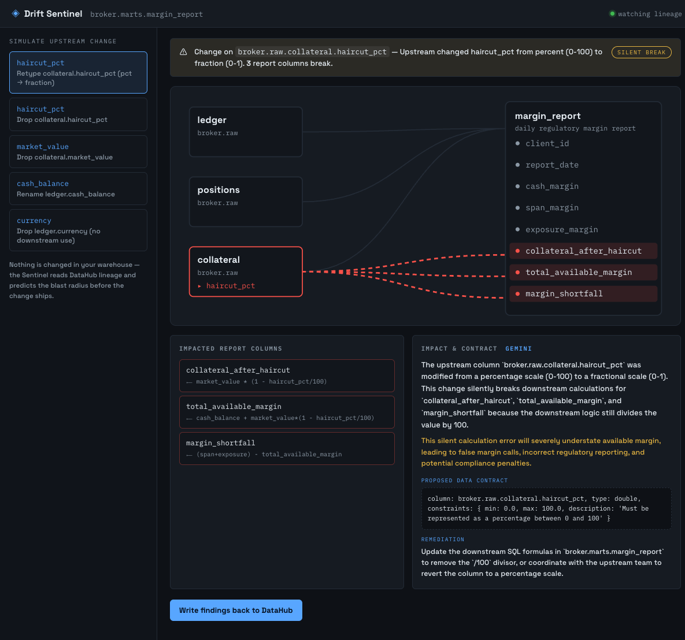

# Compliance Drift Sentinel

> An AI agent that reads **DataHub column-level lineage** to predict which downstream report field breaks when an upstream schema changes — then **writes a proposed data contract back** to the graph.

Built for **[Build with DataHub: The Agent Hackathon](https://datahub.devpost.com/)** · Track: Open / Wildcard.

## Try it

| | |
|---|---|
| **Live demo** | **https://compliance-drift-sentinel.vercel.app** |
| API | https://compliance-drift-sentinel.onrender.com/api/health |

Both run on free tiers, so the **first request after idle takes 30–60s to wake** — give it a moment.

The hosted demo computes lineage and impact in-process, so it needs no DataHub: pick a scenario,
watch the drift path light up, read the drafted contract. **Write-back runs in demo mode there**
(it reports what it *would* write) because there is no DataHub in the cloud to write to — the
demo video shows the real write-back landing in a live DataHub, and `make up && make dev` below
reproduces it locally.

## The problem

Data teams live in fear of the *silent break*: someone renames or retypes a column three hops upstream, and a regulatory report quietly ships wrong numbers — no error, until an auditor finds it. DataHub knows the lineage; it doesn't reason about the **blast radius of a change before it lands**.

## What it does

1. Reads column-level lineage from DataHub via the **MCP Server**.
2. Takes a proposed upstream schema change and **predicts which downstream fields break**, tracing the exact lineage path.
3. **Writes back** a drift annotation + a proposed **data contract** that would fail-fast next time.
4. Demonstrated on a synthetic **fintech regulatory-report pipeline** (source ledgers → transforms → daily margin report).

A deterministic engine does the reliable impact analysis; the agent explains the risk in plain English and drafts the contract.

## Architecture

```
Schema diff ──▶ FastAPI ──▶ Impact Engine (deterministic) ──▶ Agent (narrate + draft contract)
                   │                                                    │
                   └────────── DataHub MCP Server (read lineage / write-back) ──────────┘
                                            │
                                   DataHub OSS (localhost)
```

## Quickstart

Prereqs: Docker (Colima or Desktop), Python 3.12, `uv`.

```bash
make up          # start local DataHub
make seed        # author the synthetic broker margin pipeline (column-level lineage)
make provision   # provision drift tags + structured property (for write-back)
make test        # run the test suite

# then, in two terminals:
make dev         # FastAPI backend on :8099
make ui          # React UI on :5173  (first time: make ui-install)
```

Open **http://localhost:5173** — pick an upstream change, watch the lineage graph light the
drift path to the broken margin columns, read Gemini's explanation + drafted contract, and
write the findings back to DataHub. DataHub itself: http://localhost:9002 (`datahub`/`datahub`).



## Reusable DataHub Skill (OSS contribution)

The core workflow is also packaged as a standalone **DataHub Skill** —
[`datahub-drift-contract`](./datahub-skill/) — in the same format as the official
[`datahub-skills`](https://github.com/datahub-project/datahub-skills) registry, so any agent
(Claude Code, Cursor, Gemini CLI, …) can run drift-to-contract analysis. It fills a real gap: the
official skills trace lineage and run quality checks, but none answer *"what silently breaks if I
change this, and what contract catches it?"*

## Status

See `WORKFLOW.md` for the slice plan, `DECISIONS.md` for locked choices, and `SNIPPETS.md` for
verified DataHub calls.

## License

[Apache-2.0](./LICENSE).
